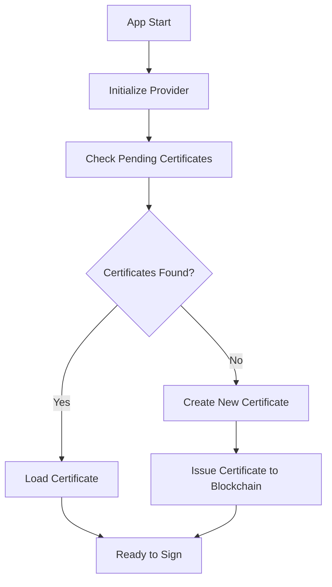
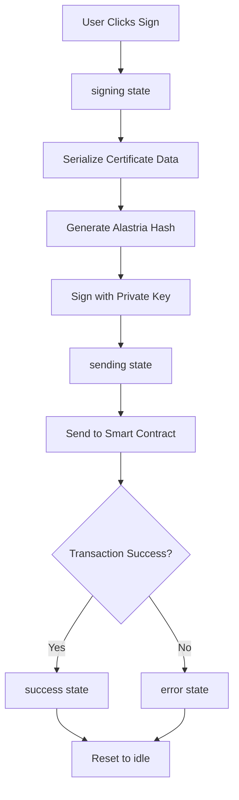

# Smart Dental Wallet

Una aplicación descentralizada (dApp) para la gestión y firma de certificados dentales utilizando la red blockchain de Alastria.

## 🚀 Descripción

Smart Dental Wallet es una aplicación web construida con SvelteKit que permite a los usuarios firmar certificados de manera segura utilizando criptografía y blockchain. La aplicación se conecta a la red Alastria para gestionar certificados dentales de forma descentralizada.

## 🏗️ Arquitectura

### Tecnologías Utilizadas

- **Frontend**: SvelteKit con TypeScript
- **Blockchain**: Red Alastria (Ethereum compatible)
- **Criptografía**: ethers.js v6
- **Estilos**: TailwindCSS

### Componentes Principales

1. **Wallet Interface**: Interfaz de usuario para mostrar información del wallet
2. **Certificate Management**: Gestión de certificados pendientes y firmados
3. **Digital Signature**: Sistema de firma digital con prefijos personalizados de Alastria
4. **Smart Contract Integration**: Interacción con contratos inteligentes

## 🔐 Proceso de Firma de Certificados

### 1. Generación del Hash del Certificado

El proceso comienza creando un hash único del certificado:

```typescript
// 1. Serialización de datos del certificado
const certificateData = {
  type: 'Login Certificate',
  timestamp: '2025-06-20T16:25:59.700Z',
  domain: 'smartdental.app',
  nonce: 'abc123def456',
  chainId: 2020,
  signature: 'waiting for signature...'
};

// 2. Conversión a string serializado
const serializedData = [
  `type:${data.type}`,
  `timestamp:${data.timestamp}`,
  `domain:${data.domain}`,
  `nonce:${data.nonce}`,
  `chainId:${data.chainId}`,
  `signature:${data.signature}`
].join('|');

// 3. Generación del hash del certificado
const certificateHash = keccak256(toUtf8Bytes(serializedData));
```

### 2. Creación del Mensaje para Firma (Alastria)

Alastria utiliza un prefijo personalizado para las firmas:

```typescript
// 1. Hash del certificado (32 bytes)
const certificateHash = keccak256(toUtf8Bytes(certificateMessage));

// 2. Prefijo personalizado de Alastria
const prefix = "\x19Alastria Signed Message:\n32";

// 3. Concatenación del prefijo + hash del certificado
const msgForSignature = concat([
  toUtf8Bytes(prefix), 
  getBytes(certificateHash)
]);

// 4. Hash final del mensaje a firmar
const msgForSignatureHash = keccak256(msgForSignature);
```

### 3. Proceso de Firma Digital

```typescript
async function signHashAlastria(certificateMessage: string): Promise<string> {
  // 1. Crear provider y wallet
  const provider = new JsonRpcProvider(RPC_URL);
  const wallet = new Wallet(PRIVATE_KEY, provider);
  
  // 2. Generar hash del certificado
  const certificateHash = keccak256(toUtf8Bytes(certificateMessage));
  
  // 3. Aplicar prefijo de Alastria
  const prefix = "\x19Alastria Signed Message:\n32";
  const msgForSignature = concat([toUtf8Bytes(prefix), getBytes(certificateHash)]);
  
  // 4. Hash final
  const msgForSignatureHash = keccak256(msgForSignature);
  
  // 5. Firmar con la clave privada
  const signatureResult = await wallet.signingKey.sign(msgForSignatureHash);
  
  // 6. Retornar firma serializada
  return signatureResult.serialized;
}
```

## 🔄 Flujo de la Aplicación

### 1. Inicialización (`preparing`)



### 2. Flujo de Firma



## 📋 Funciones del Smart Contract

### Funciones Principales

```solidity
// Firmar un certificado existente
function signCertificate(
    bytes32 _certificateHash,
    bytes _signature,
    address _recipient
) external;

// Emitir un nuevo certificado
function issueCertificate(
    bytes32 _certificateHash,
    address _recipient,
    uint256 _typeId
) external;

// Obtener certificados pendientes para un usuario
function pendingCertificatesForUser(
    address _user
) external view returns (bytes32[] memory);

// Obtener certificados firmados por un usuario
function getSigningCertificatesFor(
    address _signer
) external view returns (bytes32[] memory);
```

## 🛠️ Configuración

### Variables de Entorno

```typescript
const RPC_URL = "http://108.142.237.13:8545";
const PRIVATE_KEY = "your-private-key";
const CONTRACT_ADDRESS = "0x6847aC7DCbE1f0d87B251e2D3e325898Bee92e08";
```

### Instalación

```bash
# Clonar repositorio
git clone <repository-url>

# Instalar dependencias
npm install

# Ejecutar en desarrollo
npm run dev
```

## 🔒 Seguridad

### Consideraciones de Seguridad

1. **Claves Privadas**: Nunca hardcodear claves privadas en producción
2. **Validación**: Validar todas las entradas de usuario
3. **HTTPS**: Usar siempre HTTPS en producción
4. **Auditoría**: Los contratos inteligentes deben ser auditados

### Proceso de Verificación

```typescript
// La firma puede ser verificada recuperando el firmante
function recoverSignerAlastria(messageString: string, signatureHex: string) {
  // 1. Generar el mismo hash que se firmó
  const certificateHash = keccak256(toUtf8Bytes(messageString));
  
  // 2. Aplicar el mismo prefijo
  const prefix = "\x19Alastria Signed Message:\n32";
  const msgForSignature = concat([toUtf8Bytes(prefix), getBytes(certificateHash)]);
  
  // 3. Hash final
  const msgForSignatureHash = keccak256(msgForSignature);
  
  // 4. Recuperar dirección del firmante
  const recoveredAddress = recoverAddress(msgForSignatureHash, signatureHex);
  
  return recoveredAddress;
}
```

## 🎨 Estados de la UI

| Estado | Descripción | Color | Duración |
|--------|-------------|-------|----------|
| `preparing` | Buscando/creando certificados | Azul | Hasta completar |
| `idle` | Listo para firmar | Azul gradiente | Permanente |
| `signing` | Firmando certificado | Naranja | Hasta completar |
| `sending` | Enviando a blockchain | Púrpura | Hasta completar |
| `success` | Operación exitosa | Verde | 3 segundos |
| `error` | Error en el proceso | Rojo | 5 segundos |

## 📱 Responsive Design

La aplicación está optimizada para:
- 📱 Móviles (max-width: 480px)
- 💻 Tablets (max-width: 768px)
- 🖥️ Desktop (min-width: 769px)

## 🐛 Debugging

### Logs Importantes

```typescript
console.log('Certificate hash:', certificateHash);
console.log('Message for signature:', msgForSignature);
console.log('Final hash to sign:', msgForSignatureHash);
console.log('Signature result:', signatureResult.serialized);
```

